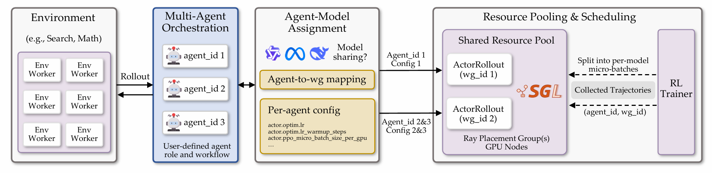
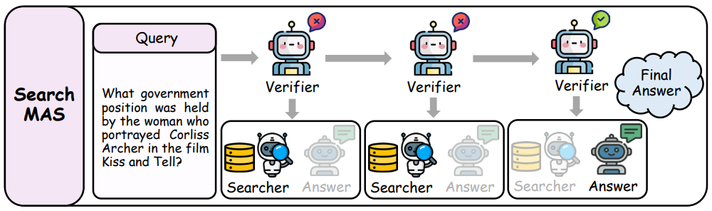

<!-- <p align="center">
    
</p> -->

<h1 align="center">
Dr. MAS: Stable Reinforcement Learning for Multi-Agent LLM Systems
</h1>


<p align="center">
  <a href="https://github.com/langfengQ/DrMAS">
    </a>
  &nbsp;
  <a href="https://github.com/langfengQ/DrMAS">
    </a>
  &nbsp;
  <a href="https://github.com/langfengQ/DrMAS">
    </a>
  &nbsp;
  <a href="https://github.com/langfengQ/DrMAS">
    </a>
</p>

`Dr.MAS` is designed for training **Multi-Agent LLM Systems** via **Reinforcement Learning (RL)**, supporting sophisticated multi-agent setups where specialized LLM-based agents collaborate to tackle complex reasoning and decision-making tasks. 

This framework features **flexible agent registry**, **customizable multi-agent orchestration**, **LLM sharing/non-sharing (e.g., heterogeneous LLMs)**, **per-agent configuration**, and **shared resource pooling**, making it well suited for training multi-agent LLM systems with RL.

<p align="center">
    
</p>

# Feature Summary

| Feature Category | Supported Capabilities|
| - | - |
| **Flexible Agent Registry** | ✅ User-defined agent registration via `@AgentRegistry.register`<br>✅ Clear role specialization per agent<br> |
| **Multi-Agent Orchestration** | ✅ User-defined multi-agent orchestration<br>✅ Sequential, hierarchical, and conditional workflows<br>✅ Built-in Search/Math Orchestra |
| **Agent-Model Assignment** | ✅ Logical agents (1,...,K) mapped to LLM worker groups<br>✅ **LLM non-sharing**: one LLM per agent (supports heterogeneous model families/checkpoints)<br>✅ **LLM Sharing**: agents using the same model share one LLM worker group |
| **Per-Agent Configuration** | ✅ Per-agent training overrides for fine-grained control <br>✅ Per-agent learning rates, micro-batch sizes, and other hyperparameters|
| **Shared Resource Pooling** | ✅ Shared GPU pool across multiple LLM worker groups for efficient hardware utilization<br>✅ Gradient updates applied independently for each worker group during optimization |
| **Environments**         | ✅ Math<br>✅ Search |
| **Model Support**        | ✅ Qwen2.5<br>✅ Qwen3<br>✅ LLaMA3.2<br>and more |
| **RL Algorithms**        | ✅ Dr.MAS<br>✅ GRPO<br>🧪 GiGPO (experimental)<br>🧪 DAPO (experimental) <br>🧪 RLOO (experimental) <br>🧪 PPO (experimental) <br>and more |

# Table of Contents

- [Installation](#installation)
  - [Install veRL](#install-verl)
  - [Install Supported Environments](#install-supported-environments)
- [Run Examples](#run-examples)
  - [Search](#search)
  - [Math](#math)
- [Multi-Agent Development Guide](#multi-agent-development-guide)
- [Acknowledgement](#acknowledgement)

# Installation

## Install veRL

```bash
conda create -n DrMAS python==3.12 -y
conda activate DrMAS

pip3 install -r requirements_sglang.txt
pip3 install flash-attn==2.7.4.post1 --no-build-isolation --no-cache-dir

pip3 install -e .
```

## Install Supported Environments


### 1. Search
```bash
conda activate DrMAS
cd ./agent_system/environments/env_package/search/third_party
pip install -e .
pip install gym==0.26.2
```

Prepare dataset:
```bash
cd repo_root/
python examples/data_preprocess/drmas_search.py
```


Since faiss-gpu is not available via pip, we setup a separate conda environment for the local retrieval server. Running this server will use around 6GB of GPU memory per GPU, so make sure to account for this in your training run configuration. Build Retriever environments:
```bash
conda create -n retriever python=3.10 -y
conda activate retriever

conda install numpy==1.26.4
pip install torch==2.6.0 torchvision==0.21.0 torchaudio==2.6.0 --index-url https://download.pytorch.org/whl/cu124
pip install transformers datasets pyserini huggingface_hub
conda install faiss-gpu==1.8.0 -c pytorch -c nvidia -y
pip install uvicorn fastapi
```

Download the index:
```bash
conda activate retriever

local_dir=~/data/searchR1
python examples/search/searchr1_download.py --local_dir $local_dir
cat $local_dir/part_* > $local_dir/e5_Flat.index
gzip -d $local_dir/wiki-18.jsonl.gz
```

Start the local flat e5 retrieval server: 
```bash
conda activate retriever

# redirect the output to a file to avoid cluttering the terminal
# we have observed outputting to the terminal causing spikes in server response times
bash examples/search/retriever/retrieval_launch.sh > retrieval_server.log 
```

### 2. Math
Prepare the dataset:
```bash
cd repo_root/
python examples/data_preprocess/drmas_math.py
```


# Run Examples

## Search

**Search (hierarchical routing)**: a 3-agent hierarchy where **Verifier** decides whether information is sufficient; it routes to **Search Agent** (generate queries) or **Answer Agent** (final response). See [`agent_system/agent/orchestra/search/README.md`](./agent_system/agent/orchestra/search/README.md).
<p align="center">
    
</p>


```bash
bash examples/drmas_trainer/run_search.sh # Dr.MAS
```
```bash
bash examples/grpo_trainer/run_search.sh # GRPO
```

After training completes, evaluate the multi-agent system on the full test dataset:
```bash
bash examples/drmas_trainer/run_search.sh eval # Dr.MAS
```
```bash
bash examples/grpo_trainer/run_search.sh eval # GRPO
```

## Math

**Math (iterative refinement)**: a 2-agent loop where **Solver** proposes step-by-step solutions and **Verifier** checks them; items are iterated until approved or max loops reached. See [`agent_system/agent/orchestra/math/README.md`](./agent_system/agent/orchestra/math/README.md).
<p align="center">
    
</p>


```bash
bash examples/drmas_trainer/run_math.sh # Dr.MAS
```
```bash
bash examples/grpo_trainer/run_math.sh # GRPO
```

After training completes, evaluate the multi-agent system on the full test dataset:
```bash
bash examples/drmas_trainer/run_math.sh eval # Dr.MAS
```
```bash
bash examples/grpo_trainer/run_math.sh eval # GRPO
```

# Multi-Agent Development Guide

For a **comprehensive guide** on developing custom multi-agent LLM systems, including detailed examples and best practices, see the **[Multi-Agent Development Guide](./docs/MULTI_AGENT_DEVELOPMENT_GUIDE.md)**.

The guide covers:
- Architecture overview and core components
- Step-by-step agent creation and registration
- Orchestra development patterns
- Configuration options and per-agent parameter overrides


# Acknowledgement

This codebase is built upon [verl-agent](https://github.com/langfengQ/verl-agent) and [verl](https://github.com/volcengine/verl). The Search environment is adapted from [Search-R1](https://github.com/PeterGriffinJin/Search-R1) and [SkyRL-Gym](https://github.com/NovaSky-AI/SkyRL/tree/main/skyrl-gym). The Math environment is adapted from [DeepScaleR](https://github.com/rllm-org/rllm) and [DAPO](https://github.com/volcengine/verl/tree/main/recipe/dapo).

We extend our gratitude to the authors and contributors of these projects for their valuable work.